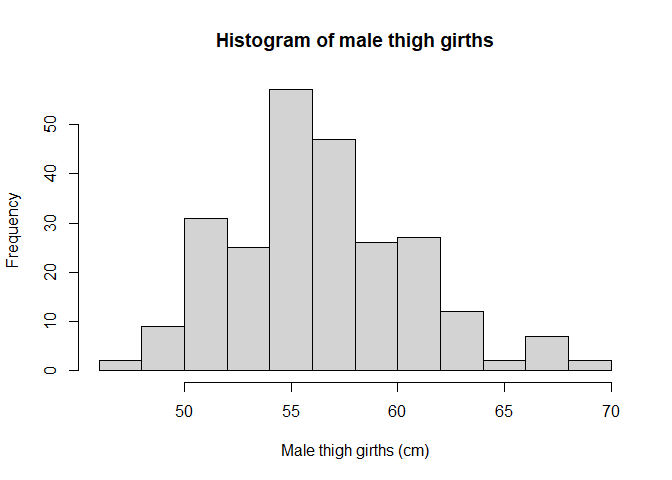
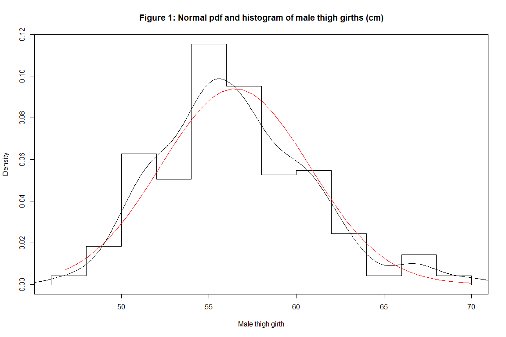
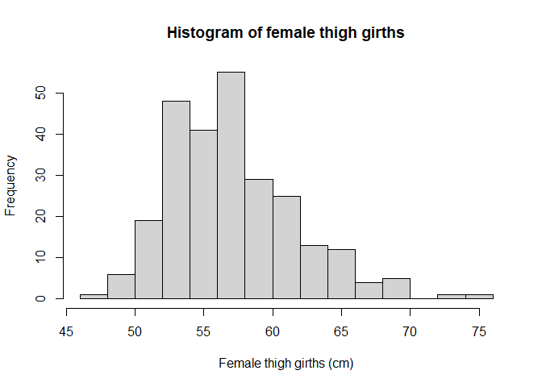
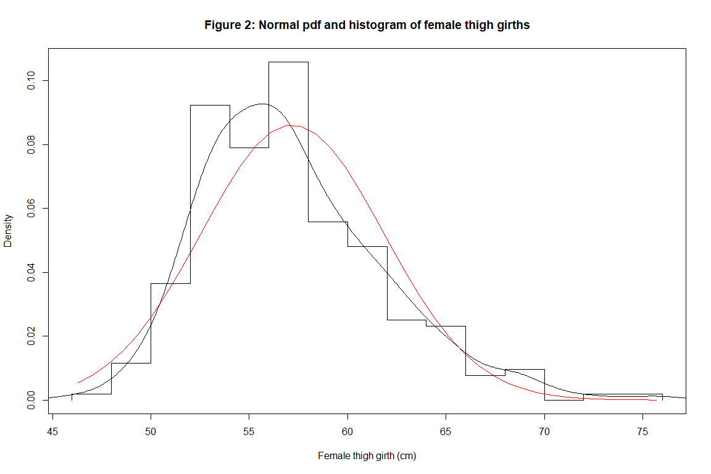

Model Body Measurement
================
Naomi Phung
14/09/2021

## Problem Statement

The purpose of this analysis is to determine if data of human thigh
measurement for each gender fits a normal distribution using the Body
Measurement data set, taken from Heinz et al. (2003),
<http://jse.amstat.org/v11n2/datasets.heinz.html>. The data set contains
the body measurements of total 507 physically active individuals
including 247 males and 260 females. For this investigation, only the
thigh girth and the gender variables are considered. The names and the
details of these two variables are:

-   **thi.gi**: Respondent’s thigh girth in centimeters, measured below
    gluteal fold as the average of right and left girths.
-   **sex**: Respondent’s gender, 1 if the respondent is male, 0 if
    female.

This analysis is carried out using R. First, summary statistics of the
thigh circumference are produced separately for different gender groups.
Then the empirical distributions of the thigh girth in men and in women
are plotted using histogram.

In order to draw a conclusion of normal distribution fitting of the
empirical data, the graphical technique of the goodness-of-fit measure
suggested by Strickland (2015) is applied by overlaying these histograms
with the curve of normal probability density function (pdf) .

In a further step, Shiparo-Wilk’s test is performed to confirm the
observations from the the graphical technique.

## Load Packages

``` r
library(readr)
library(tidyr)
library(dplyr)
```

    ## 
    ## Attaching package: 'dplyr'

    ## The following objects are masked from 'package:stats':
    ## 
    ##     filter, lag

    ## The following objects are masked from 'package:base':
    ## 
    ##     intersect, setdiff, setequal, union

## Data

Import the body measurements data and save it as a data frame named
“bdims”.

``` r
bdims <- read_csv("bdims-1.csv")
```

    ## 
    ## -- Column specification --------------------------------------------------------
    ## cols(
    ##   .default = col_double()
    ## )
    ## i Use `spec()` for the full column specifications.

``` r
colnames(bdims)
```

    ##  [1] "bia.di" "bii.di" "bit.di" "che.de" "che.di" "elb.di" "wri.di" "kne.di"
    ##  [9] "ank.di" "sho.gi" "che.gi" "wai.gi" "nav.gi" "hip.gi" "thi.gi" "bic.gi"
    ## [17] "for.gi" "kne.gi" "cal.gi" "ank.gi" "wri.gi" "age"    "wgt"    "hgt"   
    ## [25] "sex"

<p>
 
</p>
<p>
 
</p>

Subset the data with the relevant measurements for this analysis, which
are thigh girth and sex, and save it as a new data frame named
‘thi\_bdm’. See the structure of the data frame.

``` r
thi_bdm <- bdims[, c("thi.gi", "sex")]
str(thi_bdm)
```

    ## tibble [507 x 2] (S3: tbl_df/tbl/data.frame)
    ##  $ thi.gi: num [1:507] 51.5 51.5 57.3 53 55.4 57.5 60.9 56 50 59.8 ...
    ##  $ sex   : num [1:507] 1 1 1 1 1 1 1 1 1 1 ...

<p>
 
</p>

Rename the two variables to ‘thigh\_g’ and ‘gender’.

``` r
thi_bdm <- rename(thi_bdm, thigh_g = thi.gi) 
thi_bdm <- rename(thi_bdm, gender = sex) 
colnames(thi_bdm)
```

    ## [1] "thigh_g" "gender"

<p>
 
</p>
<p>
 
</p>
<p>
 
</p>
<p>
 
</p>

Factorise and label the levels of “gender” variable. Show the levels.

``` r
thi_bdm$gender <- thi_bdm$gender %>% factor(levels = c("1", "0"),
                                            labels = c("male", "female"))
levels(thi_bdm$gender)
```

    ## [1] "male"   "female"

<p>
 
</p>
<p>
 
</p>
<p>
 
</p>

## Summary Statistics

Calculate descriptive statistics (i.e., mean, median, standard deviation
(SD), first and third quartile (Q1, Q3), interquartile range (IQR),
minimum (min) and maximum (max) values) of thigh girth grouped by
gender.

``` r
thi_bdm %>% group_by(gender) %>%
  summarise(mean = mean(thigh_g, na.rm = TRUE ),
            median = median(thigh_g, na.rm = TRUE),
            SD = sd(thigh_g, na.rm = TRUE),
            Q1 = quantile(thigh_g, probs = 0.25, na.rm = TRUE),
            Q3 = quantile(thigh_g, probs = 0.75, na.rm = TRUE),
            IQR = IQR(thigh_g, na.rm = TRUE),
            min = min(thigh_g, na.rm = TRUE),
            max = max(thigh_g, na.rm = TRUE))
```

    ## # A tibble: 2 x 9
    ##   gender  mean median    SD    Q1    Q3   IQR   min   max
    ##   <fct>  <dbl>  <dbl> <dbl> <dbl> <dbl> <dbl> <dbl> <dbl>
    ## 1 male    56.5   56    4.25  53.7  59.2  5.45  46.8  70  
    ## 2 female  57.2   56.4  4.64  53.8  59.8  6.03  46.3  75.7

<p>
 
</p>
<p>
 
</p>
<p>
 
</p>

## Distribution Fitting

### Fitting male thigh girth distribution

Filter from the ‘thi\_bdm’ data frame the observations of male only.

``` r
male_thi <- thi_bdm %>% filter(gender == "male")
head(male_thi)
```

    ## # A tibble: 6 x 2
    ##   thigh_g gender
    ##     <dbl> <fct> 
    ## 1    51.5 male  
    ## 2    51.5 male  
    ## 3    57.3 male  
    ## 4    53   male  
    ## 5    55.4 male  
    ## 6    57.5 male

<p>
 
</p>
<p>
 
</p>

Histogram of male thigh girth.

``` r
male_h<- male_thi$thigh_g %>% hist(main = "Histogram of male thigh girths", breaks=15, xlab = "Male thigh girths (cm)")
```

<!-- -->

<p>
 
</p>
<p>
 
</p>

Histogram of male thigh girth with normal distribution overlay.

``` r
male_xhist<-c(min(male_h$breaks),male_h$breaks)
male_yhist<-c(0,male_h$density,0)
male_xfit<-seq(min(male_thi$thigh_g),max(male_thi$thigh_g),length=40)
male_yfit<-dnorm(male_xfit,mean=mean(male_thi$thigh_g),sd=sd(male_thi$thigh_g)) 
plot(male_xhist,male_yhist,type="s",ylim=c(0,max(male_yhist,male_yfit)), xlab="Male thigh girth", ylab = "Density",
     main="Figure 1: Normal pdf and histogram of male thigh girths (cm)")
lines(density(male_thi$thigh_g))
lines(male_xfit,male_yfit, col="red")
```

<!-- -->

<p>
 
</p>
<p>
 
</p>
<p>
 
</p>
<p>
 
</p>
<p>
 
</p>
<p>
 
</p>
<p>
 
</p>
<p>
 
</p>

### Fitting female thigh girth distribution

Filter from the ‘thi\_bdm’ data frame the observations of female only.

``` r
fem_thi <- thi_bdm %>% filter(gender == "female")
head(fem_thi)
```

    ## # A tibble: 6 x 2
    ##   thigh_g gender
    ##     <dbl> <fct> 
    ## 1    53.5 female
    ## 2    57.7 female
    ## 3    53   female
    ## 4    61.5 female
    ## 5    55   female
    ## 6    54   female

<p>
 
</p>
<p>
 
</p>

Histogram of female thigh girth.

``` r
fem_h<- fem_thi$thigh_g %>% hist(main = "Histogram of female thigh girths", breaks=15, xlab = "Female thigh girths (cm)")
```

<!-- -->
<p>
 
</p>
<p>
 
</p>
<p>
 
</p>
<p>
 
</p>
<p>
 
</p>
<p>
 
</p>

Histogram of female thigh girth with normal distribution overlay.

``` r
fem_xhist<-c(min(fem_h$breaks),fem_h$breaks)
fem_yhist<-c(0,fem_h$density,0)
fem_xfit<-seq(min(fem_thi$thigh_g),max(fem_thi$thigh_g),length=40)
fem_yfit<-dnorm(fem_xfit,mean=mean(fem_thi$thigh_g),sd=sd(fem_thi$thigh_g)) 
plot(fem_xhist,fem_yhist,type="s",ylim=c(0,max(fem_yhist,fem_yfit)), xlab="Female thigh girth (cm)", ylab = "Density",
     main="Figure 2: Normal pdf and histogram of female thigh girths")
lines(density(fem_thi$thigh_g))
lines(fem_xfit,fem_yfit, col="red")
```

<!-- -->

<p>
 
</p>
<p>
 
</p>
<p>
 
</p>
<p>
 
</p>

## Interpretation

<p>
 
</p>

#### Observations from Goodness of fit graphical technique

From Figure 1, the red curve of normal probability density function
(pdf) appears to follow the histogram bars adequately though the shape
of the empirical data density line (black) slightly skew to the right.
Therefore, using the graphical technique, the normal distribution is
visually likely to fit the empirical data of male thigh circumference.

On the other hand, figure 2 shows that the empirical data distribution
(histogram bars) of female group is skewed to the right in comparison to
the theoretical normal pdf red curve. Therefore, it is unlikely for
female thigh girth distribution to fit the theoretical normal
distribution.
<p>
 
</p>

#### Shapiro-Wilk’s normality test

In a step further, we conduct the Shapiro-Wilk’s normality test for each
gender group to confirm the above observations. If p-value &gt; 0.05,
the null hypothesis of “The sample distribution is normal” cannot be
rejected, and normality can be assumed.

For male:

``` r
shapiro.test(male_thi$thigh_g)
```

    ## 
    ##  Shapiro-Wilk normality test
    ## 
    ## data:  male_thi$thigh_g
    ## W = 0.98152, p-value = 0.002652

The p-value is 0.002652 which is less than 0.05 suggesting strong
evidence of non-normality of the male thigh girth distribution.

<p>
 
</p>

For female:

``` r
shapiro.test(fem_thi$thigh_g)
```

    ## 
    ##  Shapiro-Wilk normality test
    ## 
    ## data:  fem_thi$thigh_g
    ## W = 0.96341, p-value = 3.524e-06

The p-value of 0.000003524 &lt; 0.05. As the test is statistically
significant, the distribution of the female thigh girth can be assumed
to be non-normal.

<p>
 
</p>
<p>
 
</p>
<p>
 
</p>

#### Summary of findings

Using the graphical technique of goodness-of-fit measure to examine the
sample data set, it is found that the thigh girth distribution in man is
likely fit the normal distribution while such distribution in women is
unlikely to fit.

However, the Shiparo-Wilk’s test results suggested that the distribution
of the empirical data in both genders are not normally distributed. The
test outcomes are supported by the summary statistics, which showed both
men and women groups have mean values (56.5cm and 57.2cm respectively)
greater than median values (56cm and 56.4cm respectively). This
indicated that the mean values were pulled toward the right side of the
distribution because there are many values close to the upper limit,
which resulted the right skewness.

<p>
 
</p>
<p>
 
</p>

#### Recommendation

According to Heinz et al. (2003), the data distributions of those body
parts with high fat level tend skew to the right and might be reasonably
fit by a gamma distribution.

It is recommended that further investigation on fitting the empirical
data set to different types of probability distribution such as gamma
distribution in order to determine a more accurate distribution for
modelling the distribution of the human thigh measurement.

<p>
 
</p>
<p>
 
</p>

## References

Heinz, G, Peterson, LJ, Johnson, RW & Kerk, CJ 2003, *‘Exploring
Relationships in Body Dimensions’*, Journal of Statistics Education,
vol.11, no. , viewed 20 August 2021,
<http://jse.amstat.org/v11n2/datasets.heinz.html>.

Strickland, J 2015, *‘Data Fitting with R’*, BI Corner, viewed 20 August
2021, <https://bicorner.com/2015/04/09/data-fitting-with-r/>
